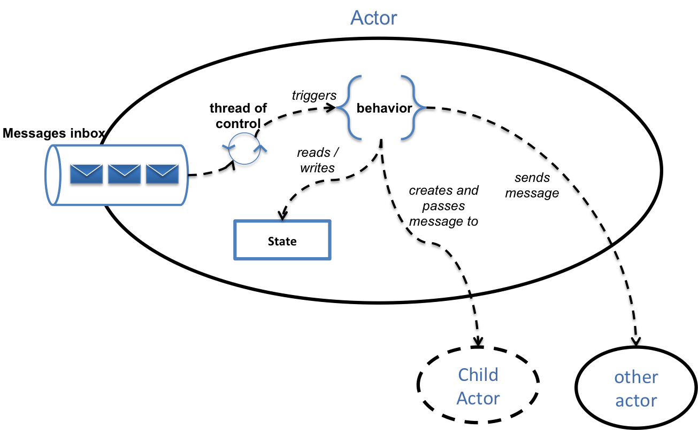
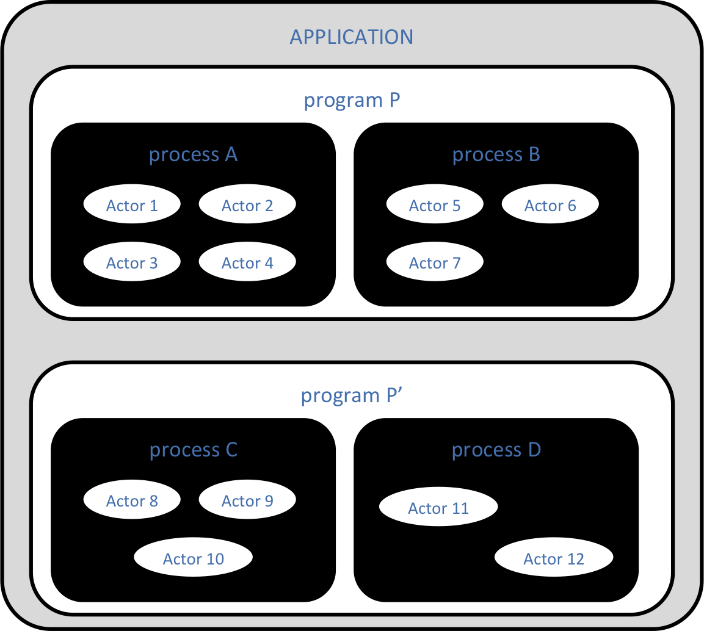

# The Hubiquitus Reference Guide

## Introduction

### The question

The post-PC era has come, marked by the emergence of plenty of digital devices - e-readers, smartphones, tablets, TVs, home weather stations, watches, snowboard goggles, tennis rackets, running shoes, boilers, supply meters, and so on - each of them especially adapted to a specific range of use cases and contexts.

More than screens, such devices now ship with an ever growing list of sensors - accelerometers, gyrometers, compass, microphones, cameras, GPS - that permanently observe their immediate proximity, thus enriching the global context data - time, social network posts, open data updates - with local live measures.

Taking advantage of this new digital space involves new requirements regarding the way we build apps:

* **ubiquity**: we need to deploy our apps to any kind of device, operating system or platform.
* **awareness**: we need to be able to collect any kind of context data - should it come from local sensors, social networks, open data APIs or any other API providing live context data - and send it to any application that could need it.
* **immediacy**: context moves quickly so its state should be streamed and processed as fast as possible.
* **memory**: we should be able to store the context data so that it could be further queried, processed or even replayed.

### Our answer

Hubiquitus aims to provide a simple way to develop apps that fulfill with these requirements. It is basically an ubiquitous programming model for building context-aware distributed live apps.

* **Actor-based apps**: applications developed using Hubiquitus are basically made of actors, a lightweight form of concurrent computational entities that sequentially process messages from an event-driven receive loop called a Reactor. Each actor makes its own decisions regarding what to do with incoming messages.
* **Full-blown JavaScript stack**: the dynamic scripting language of the web may not be the perfect language we all dream about, but it is undoubtedly the most ubiquitous one.
Native bindings: since even JavaScript can't run on every platforms, so Hubiquitus provides native bindings for major OS such as iOS, Android and Windows 8.
* **Asynchronous message passing**: like humans, Hubiquitus actors are autonomous entities which state is not share nor synchronized with other actors state. This "share nothing" strategy is enforced by using an asynchronous message-driven communication between actors.
* **Distributed P2P topology**: Hubiquitus adopts a broker-less P2P distribution model in which actors discover and connect each other dynamically at runtime, thus allowing to implement easily resilient and elastic architectures. Direct peering also provides more direct connections which contribute to decrease communication latency.
* **Lightweight socket-based transport**: actors connect each other using various forms of sockets used to transport messages using a very small footprint transport protocol  ; the combination of PGM, TCP and HTML5 Web sockets allows covering most network topologies.
* **Messaging patterns**: Hubiquitus actors can send messages to other actors using either a point-to-point, a publish-subscribe, a master-worker strategies or event a combination of these patterns.
* **Big data strategy**: the whole message history is transparently persisted into a NoSQL database.

### We stand on the shoulders of giants!

Hubiquitus gets its fabulous power from of mix of well-known magical (and also free and open source) ingredients...

* [NodeJS](nodejs.org)
* [0MQ](zeromq.org)
* SocketIO
* MongoDB

### It's free and open source

Hubiquitus is an open source software licensed under the terms of the [MIT license](http://opensource.org/licenses/MIT).  This document itself, as the whole documentation provided with the project, is licensed under the terms of the Creative Commons Attribution Unported 3.0 ([CC BY 3.0](http://creativecommons.org/licenses/by/3.0/)).

Hubiquitus is thus provided absolutely free of charge so you should feel free to use it as you like without restrictions.

Project's code and documentation repos are available on [github](https://github.com/hubiquitus/).

## Technical design

### Everything is an actor

The Hubiquitus design follows the "everything is an actor" philosophy, meaning that every Hubiquitus apps are made of actors, thus complying with the [Actor Model](http://en.wikipedia.org/wiki/Actor_model)) paradigm.

**An actor is a form of lightweight computational entity that sequentially process incoming messages received on its inbox**

Actors in Hubiquitus comply with the fundamental principles of an actor: 

* each actor has an **inbox**, a kind of FIFO queue into which other actors can post messages to be processed,
* each actor has its proper **behavior** that is triggered sequentially for each message received in its inbox,
* each actor maintains its own **state** that it doesn't share with anyone else ("share nothing" principle); this state can be modified as the actor processes incoming messages.
* each actor can itself post **messages** to other actors; posting message is asynchronous so that it never blocks the process in which the actor is running,
* each actor can create **children** to which it will then be able to post messages as to any other actor.

The following figure summarizes these principles:



### The 'russian dolls' 

The structure of Hubiquitus apps take the form of a "russian doll" with four nested levels:

* `actor`: actors are the smallest building part of an application; they implement the elementary blocks of logic that are necessary to implement the features of the app,
* `process`: actors live in single-threaded processes; a single process can host an unlimited number of actors, as far as there's a sufficient amount of memory available.
* `program`: for various reasons, actors may be distributed on multiple processes running on a same host. for example, the child of an actor can be hosted in a forked process. These linked processes constitute what we call a program.
* `application`: hubiquitus apps are distributed applications that involve potentially many programs and many hosts

The following figure summarize this topology:


### The root and the forest

We said that a process hosts multiple actors, but we need to be more precise: a process host only one `root actor` which itself potentially creates somes children, which themselves potentially create grandchildren, which themselves…and so one.

We can say that **each process hosts the root of a tree of actors**. With the multiple processes it involves, **an application can be see as a forest of actors**.  

### Child actors and child processes

Actors are free to create as many child actors they want. These actors can either be created:

* **in the same running process**: the child actor is created in the same process as its parent
* **in a new process**: the child actor runs in its own process that has been forked from the  parent process.

In both cases, child actors are stopped and destroyed when the parent actor's process stops.

> note: to come in future versions (i) the ability to host a child in a process that already exists (ii) the ability to host a child actor in a processs that is not a "child" process


## Implementation details

### Hubiquitus programs are NodeJS ones

Hubiquitus is basically an implementation of the actor model for the great [NodeJS](http://nodejs.org) evented programming platform.

NodeJS is a natural choice as a core to implement the actor model since it provides features that comply with many aspects of the actor model:

* **Single threaded execution**: each NodeJS process run programs using a single execution thread, we are sure to never have to deal with concurrency issues.
* **Asynchronous evented I/O**: NodeJS allows a program to register to specific I/O events - such as "bytes has been written to this socket" - without blocking the execution thread until it occurs. This provides a simple and elegant way to implement the actor's inbox.
* **Child processes**: NodeJS natively supports creating forked process that communicates with their parent process using an IPC socket channel, so that creating child actors as child processes becomes trivial.
* **First-class functions**: since it relies on the JavaScript programming language, NodeJS allows passing functions as parameters so that passing a behavior as a function to an actor is also trivial.

### The `hactor`object

Most of the Hubiquitus magic lay behind a single JavaScript objet called `hactor` that defines the structure common to every Hubiquitus actors:

* `actor id`: a **unique** key that identifies the actor, a simple string formatted like a Jabber ID,
* `behavior`: a **Javascript calllback** that is fired each time the actor receives a message,
* `endpoints`: a set of **addresses** onto which the actor will accept incoming messages
* `state`: an in-memory object that holds the state of the actor and onto which the behavior can make reads and writes,
* `children`: a list of references to child actors that could have been created by this actor
* `trackers`: a list of references to 'tracker' actors, a special actors that maintain the address book of all the actors

### Your first actor

All you have to do to create an actor is to instanciate this object with the following parameters:

* a unique actor **ID**
* a list of **one or more URLs** - the actor's inbound endpoints - that the actor will listen to for incoming messages,
* a **custom JavaScript callback** - the actor's behavior - that will be fired each time a message is received.

Once instanciated, you just have to start your actor and begin sending it messages, *et voilà* !

```js
// 	Instanciate your actor
var MyActor = require('hubiquitus').hactor(
	{ id: "myactor@localhost", in:["tcp://*.8888"]},
	function(err, message){
		// code your behavior below
	});

// Starting your actor
MyActor.start();
```

#### Inbound adapters

When you start your actor, the "hactor" class will first select, instanciate and start the inbound adapters that match the endpoint URLs you have specified.

Inbound adapters are special objects that are responsible for:

* listening to the port you have specified using the transport protocol you have specified
* registering the actor's behavior (remember, the custom callback you specified) to further I/O events (incoming messages)

The figure below summarizes these principles:

Authors and Contributors

@alexmama

## References

@TODO@